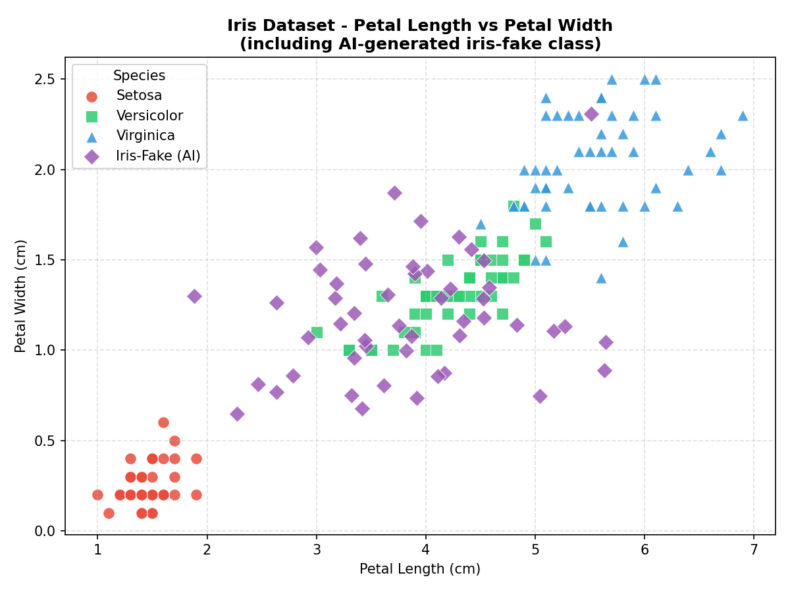

# 🌸 מסווג פרחי האירוס — Iris Flower Classifier (4 מחלקות)

> פרויקט למידת מכונה לסיווג **4 מחלקות** של פרחי אירוס — שלושה מינים אמיתיים ומחלקה סינתטית רביעית בשם **iris-fake** שנוצרה על ידי בינה מלאכותית
> **צוות:** `biu-he01` | **דיוק:** 90% | **Python 3.8+**

---

## 📋 תיאור הפרויקט

פרויקט זה בונה מסווג חכם לזיהוי **4 מחלקות** של פרחי אירוס.
המודל מאומן על מערך מורחב הכולל 150 דגימות אמיתיות מ-`sklearn` ו-50 דגימות סינתטיות שנוצרו על ידי בינה מלאכותית.
המודל משיג **דיוק של 90%** ומייצר גרפים מפורטים לניתוח הביצועים.

| פרט | ערך |
|-----|-----|
| שם הצוות | `biu-he01` |
| שפת תכנות | Python 3.8+ |
| אלגוריתם | MLPClassifier (רשת עצבית) |
| מערך נתונים | Iris (sklearn) + iris-fake (AI) |
| סה"כ דגימות | 200 (50 לכל מחלקה) |
| דיוק | **90.00%** |
| קבוצת בדיקה | 40 דגימות |

---

## 🌺 מערך הנתונים — Iris Dataset (מורחב)

מערך הנתונים **Iris** הוא אחד ממערכי הנתונים המפורסמים ביותר בלמידת מכונה, שפורסם על ידי **רונלד פישר** בשנת **1936**.
הגרסה המורחבת מוסיפה מחלקה רביעית סינתטית — **iris-fake**.

### 🔬 ארבע המחלקות

| מחלקה | סוג | צבע בגרף | מאפיינים |
|--------|------|-----------|-----------|
| 🔴 Setosa | אמיתי | אדום | עלים קצרים וצרים — קל לזיהוי |
| 🟢 Versicolor | אמיתי | ירוק | ממוצע בין המינים |
| 🔵 Virginica | אמיתי | כחול | עלים ארוכים ורחבים |
| 🟣 **Iris-Fake** | **AI סינתטי** | סגול | ממוצע כל המינים + רעש גאוסיאני |

### 🤖 איך נוצרה iris-fake?

```python
mean_features = X_real.mean(axis=0)        # ממוצע 150 הדגימות האמיתיות
std_features  = X_real.std(axis=0) * 0.5   # רעש = 50% מסטיית התקן
X_fake = rng.normal(loc=mean_features, scale=std_features, size=(50, 4))
```

### 📐 ארבע התכונות (Features)

| תכונה | שם באנגלית | תיאור |
|--------|-----------|-------|
| אורך גביע | Sepal Length | אורך עלי הכותרת החיצוניים (ס"מ) |
| רוחב גביע | Sepal Width | רוחב עלי הכותרת החיצוניים (ס"מ) |
| אורך עלה | Petal Length | אורך עלי הכותרת הפנימיים (ס"מ) |
| רוחב עלה | Petal Width | רוחב עלי הכותרת הפנימיים (ס"מ) |

---

## 🧠 המודל — MLPClassifier

**MLP (Multi-Layer Perceptron)** היא רשת עצבית מלאכותית הלומדת לסווג דגימות דרך שכבות של נוירונים מחוברים.

### 🏗️ ארכיטקטורת הרשת

```
קלט (4 נוירונים — התכונות)
        ↓
שכבה נסתרת 1 — 64 נוירונים [ReLU]
        ↓
שכבה נסתרת 2 — 32 נוירונים [ReLU]
        ↓
פלט (4 נוירונים — מחלקה לכל סוג פרח)
```

### ⚙️ פרמטרי המודל

| פרמטר | ערך | הסבר |
|--------|-----|-------|
| `hidden_layer_sizes` | `(64, 32)` | שתי שכבות נסתרות |
| `activation` | `relu` | פונקציית הפעלה לאי-לינאריות |
| `solver` | `adam` | אופטימייזר יעיל ומהיר |
| `max_iter` | `300` | מספר איטרציות מקסימלי |
| `random_state` | `42` | קיבוע לשחזוריות |

### 📊 חלוקת הנתונים

```
200 דגימות סה"כ
├── 🏋️ אימון (Train): 160 דגימות — 80%
└── 🧪 בדיקה (Test):   40 דגימות — 20%
```

---

## 📈 תוצאות

### מטריצת הבלבול — Confusion Matrix (4×4)


| | Setosa | Versicolor | Virginica | Iris-Fake |
|--|:-:|:-:|:-:|:-:|
| **Setosa** | ✅ **10** | 0 | 0 | 0 |
| **Versicolor** | 0 | ✅ **8** | 0 | ⚠️ 2 |
| **Virginica** | 0 | 0 | ✅ **10** | 0 |
| **Iris-Fake** | 0 | ⚠️ 2 | 0 | ✅ **8** |

- **Setosa ו-Virginica** — זוהו בצורה מושלמת (10/10)
- **Versicolor ו-Iris-Fake** — בלבול קל (2/10) בגלל דמיון בתכונות

> 🏆 **דיוק סופי: 90.00%** (36/40 נכון)

### עקומת האובדן — Loss Curve


ירידה חדה בשלבים הראשונים → התייצבות הדרגתית לאורך 300 האיטרציות.

---

## 🖼️ הסבר הגרפים

### 1. גרף הפיזור — `dataset_plot.png`



מציג את כל 200 הדגימות על גרף **Petal Length vs Petal Width**:
- 🔴 **Setosa** — מובדלת לחלוטין בפינה השמאלית-תחתונה
- 🟢 **Versicolor** — אזור ביניים עם חפיפה קלה
- 🔵 **Virginica** — עלים גדולים, פינה ימנית-עליונה
- 🟣 **Iris-Fake** — מפוזרת באזור המרכזי (ממוצע כל המינים)

### 2. מטריצת הבלבול — `confusion_matrix.png`

מטריצה 4×4 המציגה תוויות אמיתיות מול חזויות.
אלכסון כהה = סיווג נכון | תאים בהירים = שגיאות.

### 3. עקומת האובדן — `loss_curve.png`

ירידת ה-Loss לאורך האימון — ממחישה את תהליך הלמידה של הרשת.

---

## 🗂️ מבנה הקבצים

```
iris-classification/
│
├── 📄 model.py               — אימון והערכת המסווג (4 מחלקות)
├── 📄 create_dataset.py      — יצירת מערך הנתונים + iris-fake
│
├── 📊 dataset.csv            — מערך נתונים מאוחד (200 דגימות, 4 מחלקות)
├── 🖼️  dataset_plot.png       — גרף פיזור — 4 מחלקות ב-4 צבעים
├── 🖼️  confusion_matrix.png   — מטריצת בלבול 4×4
├── 🖼️  loss_curve.png         — עקומת האובדן לאורך האימון
│
├── 📝 PRD.md                 — מסמך דרישות מוצר (עברית)
├── 📝 PLAN.md                — תכנית פיתוח שלב-אחר-שלב
├── 📝 REPORT.md              — דוח תוצאות מפורט (עברית)
├── 📝 TODO.md                — רשימת משימות עם סימון השלמה
└── 📝 README.md              — קובץ זה
```

---

## ⚙️ התקנה והרצה

### דרישות מוקדמות

```bash
pip install scikit-learn matplotlib seaborn numpy pandas
```

### שלב 1 — יצירת מערך הנתונים

```bash
python create_dataset.py
```

**פלט:**
```
Saved: dataset.csv  (200 rows, 5 columns)
  Class counts: {'setosa': 50, 'versicolor': 50, 'virginica': 50, 'iris-fake': 50}
Saved: dataset_plot.png
```

### שלב 2 — אימון המסווג

```bash
python model.py
```

**פלט:**
```
Training samples : 160
Testing  samples : 40
Training finished after 300 iterations.

Confusion Matrix:
[[10  0  0  0]
 [ 0  8  0  2]
 [ 0  0 10  0]
 [ 0  2  0  8]]

Test Accuracy: 90.00%
Saved: confusion_matrix.png
Saved: loss_curve.png
```

---

## 🏁 מסקנות

- ✅ המודל השיג **90% דיוק** על מערך 4 מחלקות כולל מחלקה סינתטית
- ✅ **Setosa ו-Virginica** — זוהו בצורה מושלמת (10/10)
- ⚠️ **iris-fake ו-Versicolor** — בלבול קל בגלל דמיון בתכונות הממוצעות
- ✅ ארכיטקטורת MLP עם שכבות 64→32 מספיקה לבעיה זו
- 🔭 לשיפור: הגדלת `max_iter`, Cross-Validation, כוונון פרמטרי iris-fake

---

*נבנה על ידי צוות `biu-he01` | כלים: Python · scikit-learn · numpy · matplotlib · seaborn · pandas*
