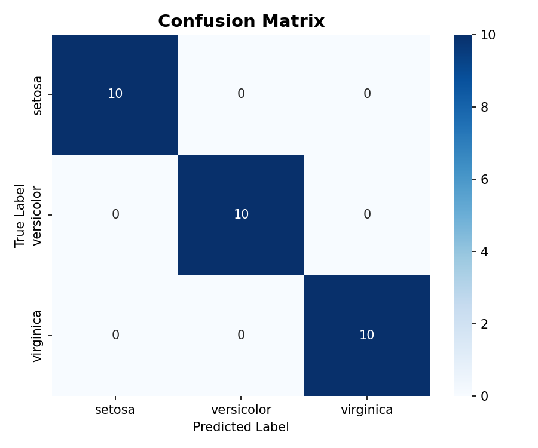
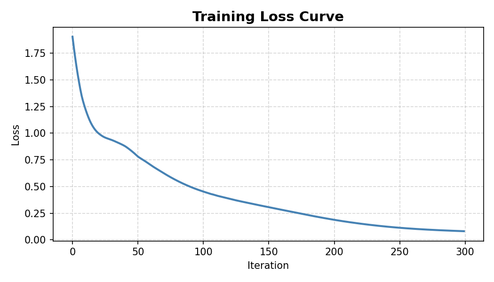

# דוח סיווג פרחי האירוס (Iris Classification Report)

---

## 1. תיאור מערך הנתונים — Iris Dataset

מערך הנתונים Iris הוא אחד ממערכי הנתונים הקלאסיים ביותר בלמידת מכונה, שפורסם לראשונה על ידי הביולוג רונלד פישר בשנת 1936.

המערך מכיל **150 דגימות** של פרחי אירוס, המחולקות שווה בשווה לשלושה מינים:

| מין | מספר דגימות |
|-----|--------------|
| Iris Setosa | 50 |
| Iris Versicolor | 50 |
| Iris Virginica | 50 |

כל דגימה כוללת **4 תכונות** (features):

1. **Sepal Length** — אורך הגביע (ס"מ)
2. **Sepal Width** — רוחב הגביע (ס"מ)
3. **Petal Length** — אורך העלה (ס"מ)
4. **Petal Width** — רוחב העלה (ס"מ)

המשימה היא לסווג כל דגימה לאחד משלושת המינים על סמך ארבע תכונות אלו.

---

## 2. תיאור המודל — MLPClassifier

המודל שנבחר הוא **רשת עצבית מלאכותית** מסוג **MLP (Multi-Layer Perceptron)** מספריית `scikit-learn`.

### ארכיטקטורת המודל:

- **שכבת קלט:** 4 נוירונים (בהתאם ל-4 התכונות)
- **שכבה נסתרת ראשונה:** 64 נוירונים, פונקציית הפעלה ReLU
- **שכבה נסתרת שנייה:** 32 נוירונים, פונקציית הפעלה ReLU
- **שכבת פלט:** 3 נוירונים (אחד לכל מין)

### פרמטרים עיקריים:

| פרמטר | ערך |
|--------|-----|
| `hidden_layer_sizes` | (64, 32) |
| `activation` | relu |
| `solver` | adam |
| `max_iter` | 300 |
| `random_state` | 42 |

### חלוקת הנתונים:

- **אימון (Train):** 80% — 120 דגימות
- **בדיקה (Test):** 20% — 30 דגימות
- חלוקה בוצעה עם `stratify=y` לשמירה על פרופורציות שוות בין המחלקות.

---

## 3. מטריצת הבלבול — Confusion Matrix

לאחר אימון המודל, בוצעה חיזוי על קבוצת הבדיקה (30 דגימות). תוצאות המטריצה:

|  | Setosa (חיזוי) | Versicolor (חיזוי) | Virginica (חיזוי) |
|--|:-:|:-:|:-:|
| **Setosa (אמת)** | **10** | 0 | 0 |
| **Versicolor (אמת)** | 0 | **10** | 0 |
| **Virginica (אמת)** | 0 | 0 | **10** |

### פירוש התוצאות:

- **אפס שגיאות** — המודל סיווג נכון את כל 30 הדגימות בקבוצת הבדיקה.
- **דיוק (Accuracy): 100.00%**
- כל מין זוהה בצורה מושלמת ללא כל ערבוב בין הקטגוריות.

**גרף מטריצת הבלבול:** `confusion_matrix.png`

---

## 4. עקומת האובדן — Loss Curve

עקומת האובדן מציגה את ירידת ערך פונקציית ה-Loss לאורך איטרציות האימון.

**גרף עקומת האובדן:** `loss_curve.png`

### פירוש הגרף:

- **ציר X (אופקי):** מספר האיטרציה (Iteration) — כל שלב של עדכון משקולות הרשת.
- **ציר Y (אנכי):** ערך ה-Loss — מדד לטעות של המודל; ככל שנמוך יותר, כך המודל מדויק יותר.
- **מגמה:** ניתן לראות ירידה חדה בשלבים הראשונים של האימון, ולאחר מכן התייצבות הדרגתית.
- האופטימייזר `adam` מאפשר התכנסות יעילה ומהירה, כפי שמתבטא בעקומה החלקה.
- המודל הגיע ל-300 איטרציות (הגבול שהוגדר) עם ערך Loss נמוך מאוד.

---

## 5. מסקנות

1. **ביצועים מעולים:** המודל השיג דיוק של **100%** על קבוצת הבדיקה — תוצאה המעידה על כך שהמודל למד בהצלחה לזהות את שלושת מיני האירוס.

2. **מערך נתונים מתאים:** מערך Iris הוא מערך קטן ומובנה היטב, מה שמאפשר לרשת עצבית גם בגודל קטן להשיג תוצאות מושלמות.

3. **אזהרת התכנסות:** המודל הנפיק אזהרת `ConvergenceWarning`, שמשמעותה שהאופטימייזר לא הגיע לנקודת התכנסות מלאה תוך 300 איטרציות. ניתן לפתור זאת על ידי הגדלת `max_iter` ל-500 ומעלה.

4. **הכללה (Generalization):** הדיוק המושלם מעיד שהמודל לא רק שינן את נתוני האימון אלא הכליל היטב לדגימות חדשות שלא ראה.

5. **המלצה לעתיד:** לצורך בדיקה מקיפה יותר, מומלץ לבצע **Cross-Validation** (אימות צולב) ולנסות ארכיטקטורות שונות לצורך השוואה.
